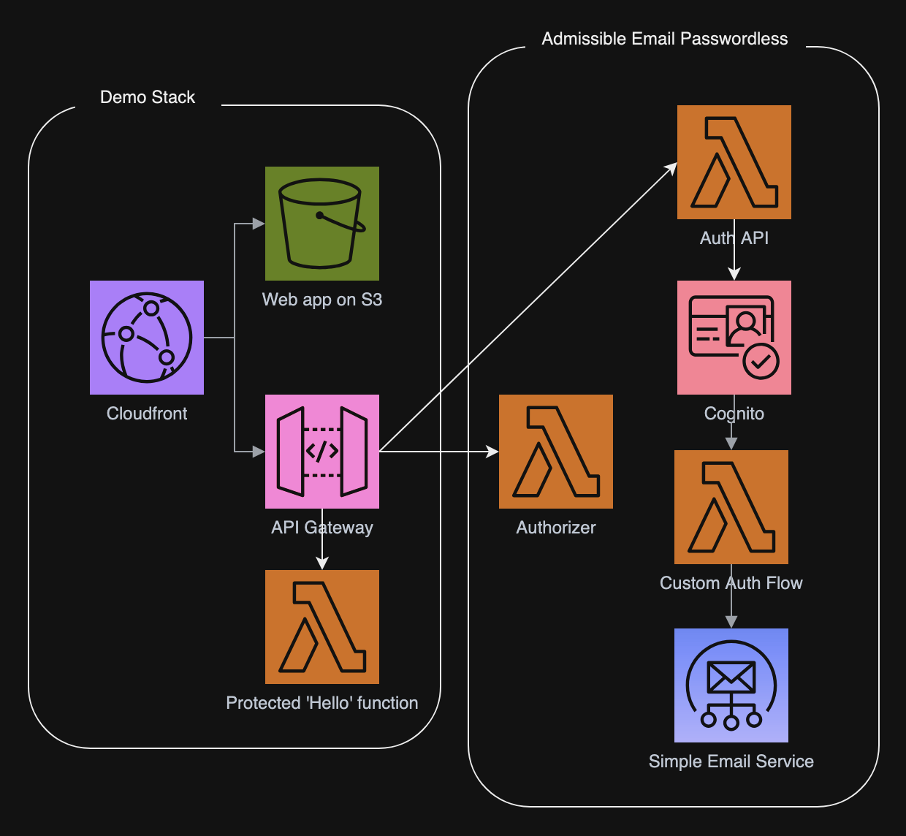

# Admissible Demo

[Admissible Email Passwordless](https://github.com/joagr/admissible-email-passwordless)
provides an AWS CDK construct and supporting Lambda functions
for deploying a Cognito user pool with a custom authorization flow,
configured for signing in with a one-time-password sent via Simple Email Service.

This repository provides a deployable demo of _Admissible Email Passwordless_.
This demo comes with a small React web app to be deployed on S3,
and an AWS CDK deployment stack.
The deployment stack includes the `AdmissibleEmailPasswordless` construct,
along with an API Gateway with the _Admissible_ authorization API routes,
and a protected "hello" Lambda.
The stack deploys a CloudFront distribution,
which proxies the S3 web app together with the API Gateway.


## Scope

_Admissible Email Passwordless_ and this demo **only** provide sign-in, authentication, and sign-out.
Sign-up is outside the scope.


## Disclaimer

This is currently (October 2024) at the "hobby project" stage (not battle tested).
It has not been used for any production environments that I am aware of.


## Screen Shots

Screen shots of the small demo web app are available in the [screenshots](screenshots/screenshots.md) directory.


## Services Diagram




## Usage

To try the demo, use AWS CDK to deploy this stack on your account.
A little configuration is required first.


### Simple Email Service

_Admissible_ requires but does **not** set up SES. You must do that beforehand.
You must also test that your SES configuration is working with the From and To email addresses you intend to use.


### Admissible Config

The file `cdk/lib/configure-admissible.ts` is not included in this repository.
Create it with the following content,
and then edit it to your desired configuration.
Be sure to review the doc-comments for the properties in `AdmissibleConfig`
[here](https://github.com/joagr/admissible-email-passwordless/blob/main/lib/admissible.ts).
The default values will **NOT** all work for you.

```typescript
import { AdmissibleConfig } from 'admissible-email-passwordless';

export function getAdmissibleConfig(): AdmissibleConfig {
  const admissibleConfig = new AdmissibleConfig();
  admissibleConfig.otpFrom = ...your "From" email address here...
  ...your other configuration here...
  (See the doc-comments from the AdmissibleConfig class for details.)
  return admissibleConfig;
}
```

### CDK

Launch cdk from the cdk directory. One of the outputs from this CDK stack is the URL of the deployed web app (the URL to the CloudFront deployment).

(Regarding "AWS_SOLUTIONS_CONSTRUCTS_WARNING" in the CDK output:
I am leveraging the [CloudFrontToS3](https://docs.aws.amazon.com/solutions/latest/constructs/aws-cloudfront-s3.html) Construct. It creates the S3 bucket for the webapp, as well as buckets for logging. I have overridden the `removalPolicy` on a couple of those buckets so that they are deleted when the demo stack is destroyed. That results in the warning.)


## Cognito User

After setting up SES and deploying the demo stack, use the AWS console (or an API) to add a user to the Cognito User Pool created by the demo stack. The user only needs an email address, and the password is not used at all. At that point, you should be ready to sign in to the demo with that email address.
